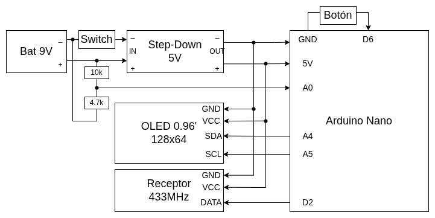

# Detector de Protocolo RF 433MHz v1.0

Dispositivo portátil para analizar señales de radiofrecuencia a 433MHz. Permite identificar si un control remoto utiliza **código fijo** (clonable) o **rolling code** (no clonable), mostrando los resultados en pantalla OLED en tiempo real.

  

---

## Índice

1. [¿Cómo funciona?](#cómo-funciona)
2. [Uso del dispositivo](#uso-del-dispositivo)
3. [Hardware](#hardware)
4. [Software](#software)
5. [Fabricación](#fabricación)
6. [Roadmap](#roadmap)

---

## ¿Cómo funciona?

El dispositivo escucha señales en la frecuencia de **433.92MHz** a través de un receptor RF. Cuando detecta una transmisión, captura el **código**, el **protocolo** y la **cantidad de bits** de cada paquete recibido.

El proceso requiere **al menos 3 pulsaciones del control a analizar** (con reintento automático hasta 5 si las muestras no coinciden por ruido). Con esas capturas compara si los datos son idénticos entre sí:

- **Código fijo:** al menos 3 paquetes iguales → el control es clonable ✅
- **Rolling code:** los paquetes cambian en cada pulsación → el control no es clonable ❌

Además verifica el **bitrate** de la señal (500–700 baud): si el control trabaja fuera de ese rango muestra `BITRATE NO SOPORTADO` y no lo cuenta como pulsación.

Toda la información se visualiza en la pantalla OLED integrada.

---

## Uso del dispositivo

1. Encendido: Deslizar el interruptor lateral. La pantalla mostrará el logo y luego la pantalla de espera.
2. Apuntar el control remoto al dispositivo y presionar **3 veces** (o mantener).
3. La pantalla irá mostrando cuántas pulsaciones fueron detectadas. Si las muestras no coinciden aparece `No coinciden, repita`: apretar 1–2 veces más.
4. Al completar las capturas, se muestra el resultado:

| Pantalla          | Significado                |
| ----------------- | -------------------------- |
| **COMPATIBLE**    | Código fijo — clonable     |
| **NO COMPATIBLE** | Rolling code — no clonable |

Ambas pantallas muestran la frecuencia detectada, el protocolo y la cantidad de bits.

5. Reiniciar: Presionar el botón lateral hace que volver a la pantalla de espera. Útil para analizar otro control o si la detección falló.

6. Apagar: deslizar el interruptor lateral a la posición OFF.

**Autoapagado:** si pasan **2 minutos sin actividad** (ningún botón ni señal), el dispositivo entra solo en modo de reposo: la pantalla se apaga y el micro duerme. Apretar el botón lateral lo despierta y lo deja listo en la pantalla de espera.

La batería es recargable — cargala mediante el puerto correspondiente cuando sea necesario.

> ⚠️ La detección depende de la librería RCSwitch, que no cubre todos los protocolos existentes. Algunos controles pueden no ser reconocidos correctamente.

---

## Hardware

### Componentes

Ver lista completa de materiales en [`docs/materiales.txt`](docs/materiales.txt).

### Conexiones

  

---

## Software

[Código](https://github.com/donatolurgo08/Detector-de-protocolo-RF)

### Requisitos

El firmware está escrito en **C++ para Arduino**. Para compilarlo y flashearlo se necesita el **Arduino IDE**.

### Librerías

Instaladas desde el Library Manager del Arduino IDE:

| Librería                                       | Autor    |
| ---------------------------------------------- | -------- |
| [RCSwitch](https://github.com/sui77/rc-switch) | sui77    |
| [U8g2lib](https://github.com/olikraus/u8g2)    | olikraus |

### Flashear el dispositivo

1. Abrir la capeta `detector_de_protocolo_rf` con Arduino IDE
2. Bajar las librerias con el library manager
3. Seleccioná la placa **Arduino Nano** y puerto COM correspondiente.
4. Hacé clic en **Subir** (→).

---

## Fabricación

El gabinete está impreso en 3D y consta de 3 piezas:

| Pieza             | Archivo              |
| ----------------- | -------------------- |
| Carcasa principal | `3D/Modelo caja.stl` |
| Tapa              | `3D/Tapa.stl`        |
| Tope de pantalla  | `3D/Tapa oled.stl`   |

---

## Roadmap

Esta es la **versión 1.0** del producto. Las siguientes mejoras están planificadas:

- [x] Autoapagado automático luego de 2 minutos de inactividad (sleep del microcontrolador)
- [ ] Mejoras a la carcasa y diseño general
- [ ] Soporte para detección de señales a **315MHz**
- [ ] Diseño final en PCB dedicada para reducir costos y simplificar el ensamblado

---

_Universal Bi-Tech — Detector de Protocolo RF 433MHz_
